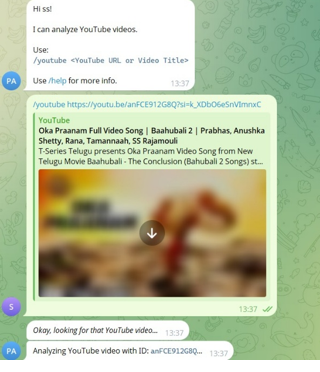
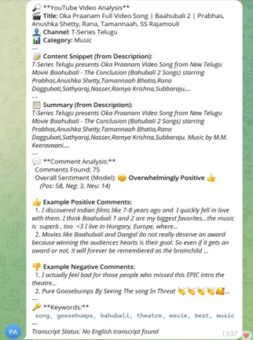

# 🎥 YouTube Review Analysis using API

This project analyzes YouTube video **comments** using **Natural Language Processing (NLP)** techniques. It leverages the **YouTube Data API** to extract comments and then performs **sentiment analysis**, **fake review detection**, **pros/cons extraction**, and **summarization** to provide meaningful insights from user reviews.


## 🚀 Features

✅ Extracts comments from any public YouTube video via video URL or ID  
✅ Filters out irrelevant or spam/fake comments  
✅ Performs:
- **Sentiment Analysis** (Positive / Negative / Neutral)
- **Fake Review Detection**
- **Pros & Cons Extraction**
- **Summary Generation** (Extractive or Abstractive)

✅ Visualizes results via charts and keyword clouds  
✅ Optionally exports processed data to CSV or JSON  


## 🔍 Example Use Case

Given a YouTube video reviewing a product (e.g., iPhone 15), the system will:
- Collect top N comments
- Determine the general sentiment
- Flag spam or bot comments
- Extract pros like "great battery", "excellent camera"
- Extract cons like "expensive", "overheats"
- Generate a 2-3 line summary for buyer clarity


## 🧰 Tech Stack

| Component            | Tool/Library                         |
|----------------------|--------------------------------------|
| Data Source          | YouTube Data API v3                  |
| Backend              | Python (Flask or Colab)              |
| NLP Libraries        | NLTK, VADER, spaCy, Transformers (HuggingFace) |
| Fake Review Filter   | Custom heuristic + model (e.g., BERT fine-tuned) |
| Visualization        | Matplotlib, WordCloud, seaborn       |
| Optional UI          | Streamlit / Flask Web UI             |

##Screenshots





## 📦 Installation

1. **Clone the repository**
```bash
git clone https://github.com/your-username/youtube-review-analysis.git
cd youtube-review-analysis
